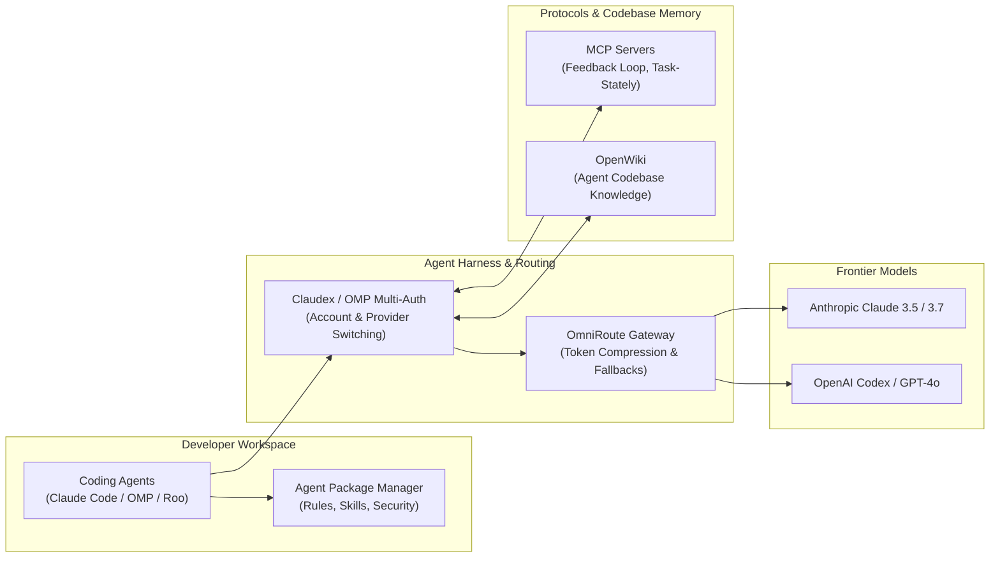

<div align="center">

# Tuan Dinh
### AI Agent Infrastructure & Developer Tooling Engineer
**Ho Chi Minh City, Vietnam**

[](https://modelcontextprotocol.io)
[](https://github.com/tuandinh0801/claudex)
[](https://openai.com)
[](https://github.com/tuandinh0801)
[](https://opensource.org/licenses/MIT)

<br/>

> Building runtime harnesses, context-optimization layers, and Model Context Protocol (MCP) tooling for autonomous coding agents.

<br/>

[Featured Systems](#-featured-open-source-systems) • [MCP Ecosystem](#-model-context-protocol-mcp-ecosystem) • [Architecture](#-ecosystem-architecture) • [OSS Grant Alignment](#-open-source-focus--grant-alignment) • [Tech Stack](#-technical-stack)

---

</div>

## 🔭 Executive Overview

I engineer tools that make autonomous coding agents more resilient, context-efficient, and secure. My work bridges frontier model harnesses (**Claude Code**, **OpenAI Codex**, and **Deep Agents**) with developer environments, multi-account routing gateways, and standardized protocol interfaces.

```
Frontier Models (Claude / Codex) ──► Routing & Quota Gateways ──► Context & Memory (OpenWiki) ──► MCP Tool Execution
```

---

## 🚀 Featured Open-Source Systems

### 🤖 Agent Runtimes & Dev Ecosystem

| System | Description | Core Stack |
| :--- | :--- | :--- |
| [**`claudex`**](https://github.com/tuandinh0801/claudex) | Seamless harness translating Claude Code agent interfaces and hook systems to OpenAI Codex backends. Preserves sub-agents, skills, and tools. | `Shell` `Node.js` `Codex API` |
| [**`agent-package-manager`**](https://github.com/tuandinh0801/agent-package-manager) | Declarative AI development environment managing coding standards, security rules, and workflow skills as single installable packages across Claude, Copilot, and OpenCode. | `APM CLI` `Claude Code` `Copilot` |
| [**`omp-multi-auth`**](https://github.com/tuandinh0801/omp-multi-auth) | Multi-account OAuth manager and dynamic quota-aware fallback plugin for the Oh My Pi (`omp`) coding agent CLI. | `TypeScript` `OAuth` `TUI` |
| [**`openwiki`**](https://github.com/tuandinh0801/openwiki) | Self-maintaining codebase documentation wiki for agents and humans powered by LangChain Deep Agents. Keeps repository memory up to date automatically. | `TypeScript` `Deep Agents` `CLI` |

### 🔌 Model Context Protocol (MCP) Ecosystem

*Standardized tools bridging models to environments and human-in-the-loop validation:*

- **[`feedback-loop-mcp`](https://github.com/tuandinh0801/feedback-loop-mcp)** — Interactive desktop GUI (Electron) + MCP server enabling structured human-in-the-loop validation during autonomous agent runs.
- **[`task-stately`](https://github.com/tuandinh0801/task-stately)** — Stateful task management CLI and MCP server providing persistent execution tracking across long-horizon agent tasks.
- **[`claude-drawio`](https://github.com/tuandinh0801/claude-drawio)** — Visual architecture diagram generation and inspection tools built for Claude Code agent workflows.
- **[`unsafe-mcp`](https://github.com/tuandinh0801/unsafe-mcp)** — Sandboxing and boundary analysis research for MCP server tool executions.

### ⚡ Gateway, Context Optimization & Security

- **[`OmniRoute`](https://github.com/tuandinh0801/OmniRoute)** *(Contributor)* — Multi-provider AI gateway supporting 340+ providers, token compression (RTK/Caveman 15–95%), and quota-aware auto-fallback.
- **[`hookify-plus`](https://github.com/tuandinh0801/hookify-plus)** — Enhanced rule triggers with inverted regex matching, value inspectors, and read-event interceptors for agent hooks.
- **[`LiteLLM-vuln-scanner`](https://github.com/tuandinh0801/LiteLLM-vuln-scanner)** — Automated vulnerability and configuration audit scanner for LLM proxy pipelines.

---

## 🏛️ Ecosystem Architecture



---

## 🎯 Open Source Focus & Grant Alignment

I am actively building open-source tooling aligned with **Anthropic Open Source Grants** and **OpenAI Codex Developer Programs**:

1. **Model Context Protocol (MCP) Standards**: Extending MCP primitives for interactive human feedback, persistent agent memory, and enterprise-grade sandboxing.
2. **Autonomous Coding Agent Ergonomics**: Reducing friction in cross-model harnesses, sub-agent spawning, rate-limit recovery, and quota fallbacks.
3. **Agent Security & Boundaries**: Hardening agent tool execution through proactive hook inspection (`hookify-plus`) and proxy vulnerability analysis.

---

## 🛠️ Technical Stack

<div align="center">

| Domain | Technologies |
| :--- | :--- |
| **Agent Runtimes & Harnesses** | Claude Code, Oh My Pi (`omp`), Roo Code, OpenAI Codex, Deep Agents |
| **Protocols & Gateways** | Model Context Protocol (MCP), OmniRoute, LiteLLM, REST / SSE |
| **Languages & Core** | TypeScript, JavaScript, Python, Shell (Bash/Zsh), Go |
| **Frameworks & UI** | Node.js, Electron, React, TailwindCSS, Commander, Ink (TUI) |
| **Testing, Evals & Security** | Vitest, Jest, Promptfoo, Agentic Evals, AST Inspection |

</div>

---

<div align="center">


<br/><br/>

```
"The bottleneck in autonomous agents isn't intelligence—it's ergonomics, context efficiency, and protocol fidelity."
```

**Connect & Collaborate:** [GitHub](https://github.com/tuandinh0801) • [LinkedIn](https://www.linkedin.com/in/tuandinh0801/)

</div>
